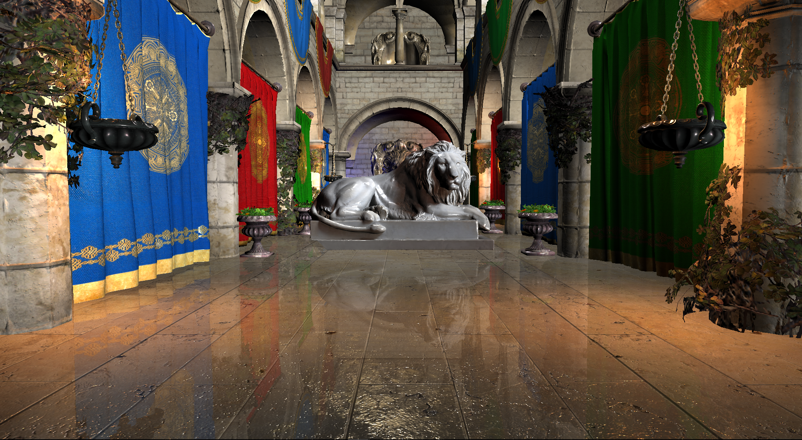

# The implementation of Pixel-projected Screen Space Reflections
* CGGT, University of Pennsylvania
* [Byumjin Kim](https://github.com/byumjin)

| PSSR |
|---|
||

- Visual Studio 2017 is required to build
- Please build this as Release version

## UI

- WASD : Move position of camera
- Mouse : Move angle of camera
- Num 2 : Change Rednering Mode
- [ , ] : Change Roughness of Reflector -/+
- < , > : Change Intensity of SSR -/+

## Thesis

- [Thesis](https://github.com/byumjin/Jin-Engine-2.1/blob/master/%5BByumjin%20Kim%5D%20Master%20Thesis_Final.pdf)
- [Slides-pptx](https://github.com/byumjin/Jin-Engine-2.1/blob/master/IMPLEMENTATION%20OF%20OPTIMIZED%20PIXEL-PROJECTED%20REFLECTIONS%20FOR%20PLANAR%20REFLECTORS_PDF.pptx)
- [Slides-pdf](https://github.com/byumjin/Jin-Engine-2.1/blob/master/IMPLEMENTATION%20OF%20OPTIMIZED%20PIXEL-PROJECTED%20REFLECTIONS%20FOR%20PLANAR%20REFLECTORS.pdf)

